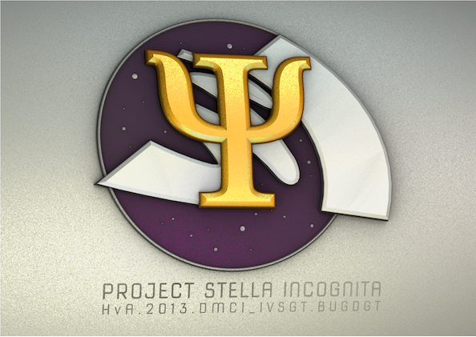

# PSI Branch 3 Irrlicht

PSI Irrlicht branch for teams 3, 6, 9 and 12.

## How to work with this repo.

We are using this repository as substitute of Gitlab due to its unstability. The behaviour it is a little bit different, but nothing we can fix.
Later, when Gitlab works again, we will discuss what we will do, if keep working here or move to Gitlab.

### Pushing your code.

**Commits to the master branch are FORBIDDEN. All changes will be reseted. Only hotfixes are allowed.**

1. Create a branch for the functionality you want to work on. It will be just for that functionality, not for the whole project.
2. All your commits and push must be on that branch. More than one person may work on a branch.
3. Once the functionality it is implemented, go to the Github website and create a new "Pull request" from the branch to the master.
4. In the comments, metion at least 2 members from other teams and also @koenbollen. They will review the pull request.

### Issues.

If you have found any bug, open an issue in the Github webpage. Address it to whom may concern.

### Documentation.

Code must be documented. For additional documentation, use the wiki. After each merge with the master branch, documentation will be generated from the source code using Doxygen and will be pushed to the webpage.

### Teams.

#### Team 3
* **Chris Justiana**  - @justia02
* Tomasz Zaremba - @zarembaT
* Sonja Kopf - @sonjakopf
* Philippe Wedema - @nlpilip
* Sandor de Klerk - @sandordeklerk

#### Team 6
* **Arco Mul** - @ArcoMul
* Sieuwerd Broekema - @sieuwerd
* Kevin Visser - @visserk002
* Joey Rommers - @Merkane

#### Team 9
* **Kevin van Mierlo** - @kevinvanmierlo
* Alberto Martinez de Murga Ramirez - @threkk
* Huub Spekman - @epikfaal
* Andreas Savva - @savvaa001

#### Team 12
* **Philip Heimböck** - @philipheimboeck
* Rob van Diepen - @rmvandiepen
* José Manuel Carmona Roldán - @carmonj001
* Merlijn Blekemolen - @merlijnblekemolen
* ~~Sandro Miccoli - @sandromiccoli~~
